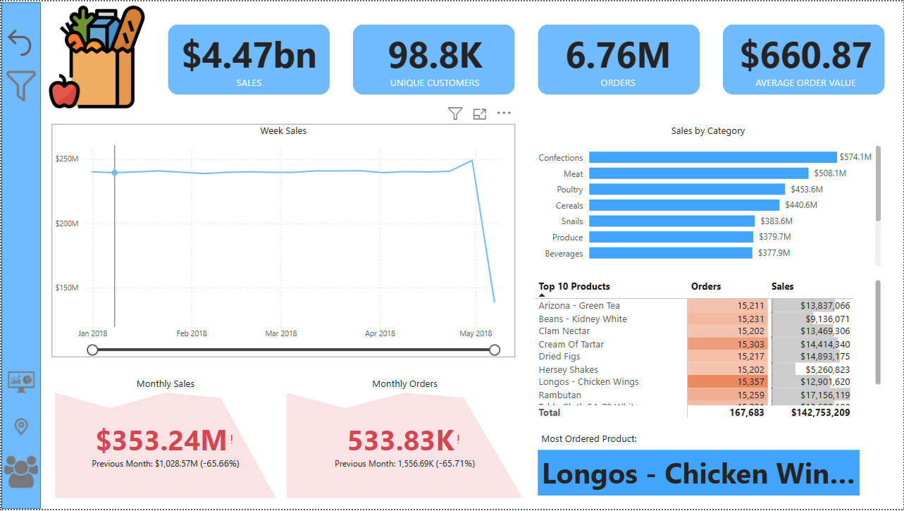
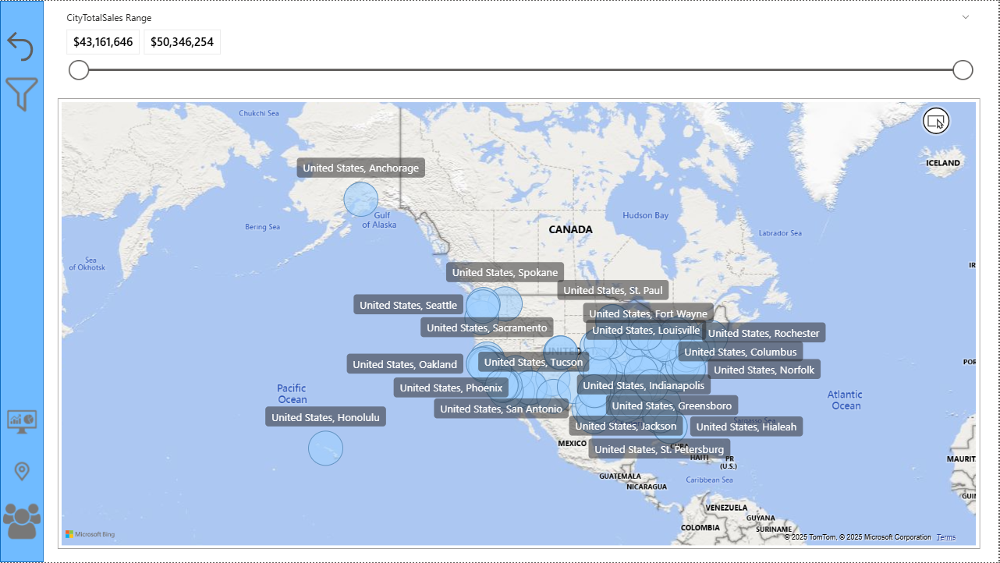
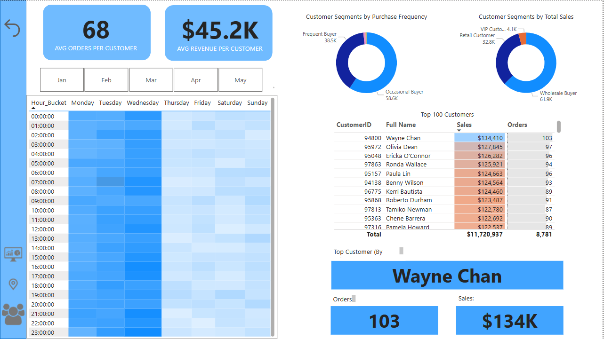

# PowerBI Grocery Dashboard

## 📥 Download PowerBI-File
You can download the Power BI file here:
[PowerBI-Grocery-Dashboard.pbix](https://drive.google.com/file/d/1Uvx6u3VWgBX5YDClAMFiYKGFzR1depFI/view?usp=drive_link)

## 📥 Dataset Link (Kaggle)
**You can find the dataset in Kaggle here:**  
[Dataset on Kaggle](https://www.kaggle.com/datasets/andrexibiza/grocery-sales-dataset)

## Introduction
This Power BI project analyzes grocery sales and customer behavior using a structured data model. The dataset comes from the **Grocery Sales Database on Kaggle**, covering transactions from **January 1, 2018, to May 9, 2018**.

The project extracts **actionable insights** by visualizing sales trends, customer segmentation, and geographical sales performance. The **data model** follows a **Star Schema**, where the **Fact_Sales** table connects with various **Dimension Tables** (Customers, Products, Categories, Cities, and Countries).

The project consists of **three interactive dashboards**, each serving a specific business need:
- **Executive Dashboard** → High-level sales performance overview.
- **Map Dashboard** → Geographical analysis of sales distribution.
- **Customer Insights Dashboard** → Deep dive into customer behavior and segmentation.

---

## 1️⃣ Executive Dashboard – Business Performance Overview

### What This Dashboard Shows:
This dashboard provides a **comprehensive snapshot of key business performance metrics** for decision-makers. It focuses on **sales trends, order volumes, customer count, and product categories**.

### 🔹 Key Insights:
**Sales Performance Metrics**
- **Total Sales:** $4.47 billion
- **Unique Customers:** 98.8K
- **Total Orders:** 6.76 million
- **Average Order Value:** $660.87
- 

**Sales Trends Over Time**
- A **line chart** visualizes **weekly sales trends**, helping businesses track fluctuations and detect patterns in revenue changes.

**Monthly Comparisons**
- **Current vs. Previous Month Sales & Orders**
- A **color-coded indicator** shows whether sales increased or declined compared to the previous month.
- **Gray color → Growth**, **Red color → Decline**

**Category Sales Breakdown**
- A **bar chart** ranks product categories based on revenue contribution, revealing the most profitable product segments.

**Top 10 Products**
- A **matrix table** ranks the top-selling products by sales and orders, helping managers identify the most popular items.

### 🎯 Business Impact:
✔ Helps executives **monitor revenue trends** and make data-driven strategic decisions.  
✔ Identifies **top-performing product categories** to optimize stock and marketing efforts.  
✔ Tracks **customer engagement** and highlights fluctuations in purchasing behavior.  

---

## 2️⃣ Map Dashboard – Geographical Sales Distribution

### What This Dashboard Shows:
The **Map Dashboard** provides a **geospatial analysis of sales performance** across different cities. It helps businesses identify **high-revenue locations** and **potential growth areas**.

### Key Insights:
**Sales Heatmap by City**
- A **bubble map** displays sales volumes per city.
- **Larger bubbles** indicate **higher revenue** locations.

**Dynamic Filtering by Revenue Range**
- A **slider filter (slicer)** allows users to adjust the range of sales displayed on the map.
- Helps in identifying **high vs. low-performing markets**.

**Interactive City-Level Sales Insights**
- Hovering over a city **reveals sales details** for that location.

### 🎯 Business Impact:
✔ Helps businesses **pinpoint top-performing regions** and expand operations accordingly.  
✔ Assists in **market segmentation** by identifying **strong vs. weak sales areas**.  
✔ Supports **location-based marketing and promotional strategies**.  

---

## 3️⃣ Customer Insights Dashboard – Understanding Customer Behavior

### What This Dashboard Shows:
The **Customer Insights Dashboard** focuses on **customer segmentation, purchase frequency, and spending patterns**. It helps businesses understand **who their customers are and how they shop**.

### Key Insights:
**Customer Order & Revenue Metrics**
- **Average Orders per Customer** → 68
- **Average Revenue per Customer** → $45.2K

**Heatmap – Peak Shopping Hours & Days**
- A **matrix heatmap** visualizes sales activity by **hour and day of the week**.
- Darker shades indicate **higher order volumes**.
- Helps businesses **optimize staffing and marketing campaigns** for peak times.

**Customer Segmentation – Shopping Behavior**
- **Segment by Purchase Frequency** (One-time, Occasional, Frequent, Loyal)
- **Segment by Total Spending** (Retail, Wholesale, VIP Customers)

**Top Customers Analysis**
- A **leaderboard of the top 100 customers** based on total sales and order count.
- Highlights the **most valuable customers** for **targeted loyalty programs**.
- Dynamically displays the **#1 customer in terms of sales and orders**.

### 🎯 Business Impact:
✔ Helps businesses **segment customers** for personalized marketing strategies.  
✔ Identifies **loyal and high-value customers** to boost retention efforts.  
✔ Optimizes inventory by **analyzing peak shopping times and product demand trends**.  

